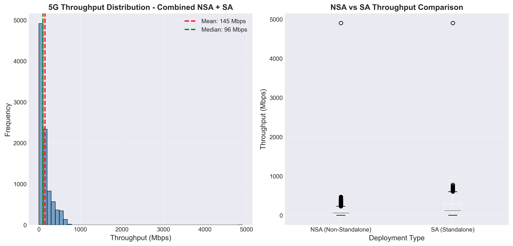
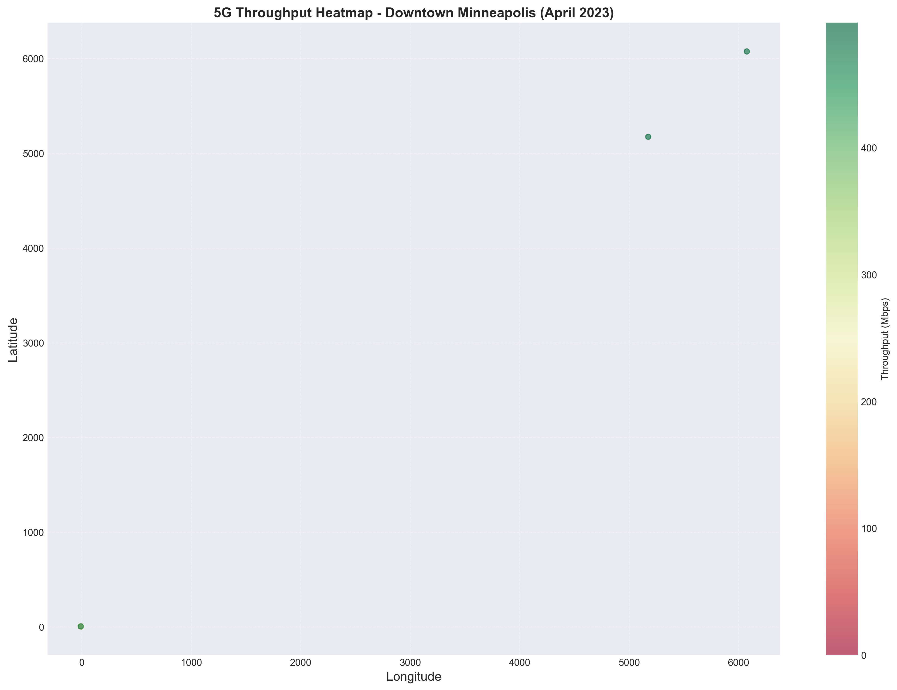
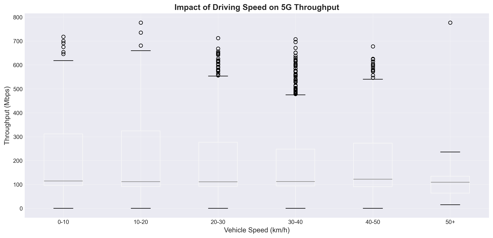
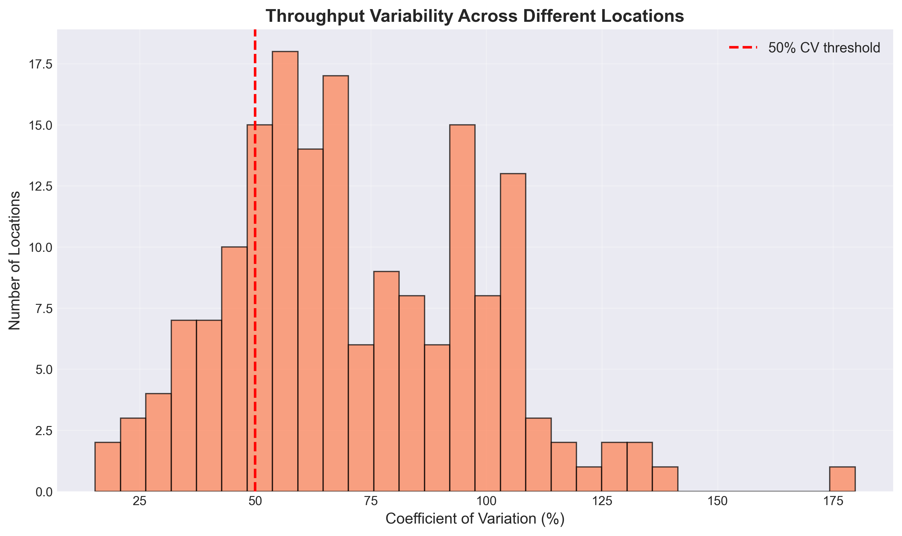
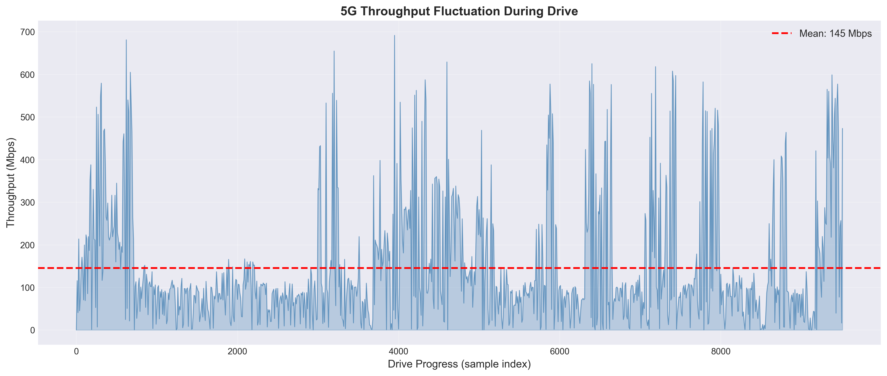
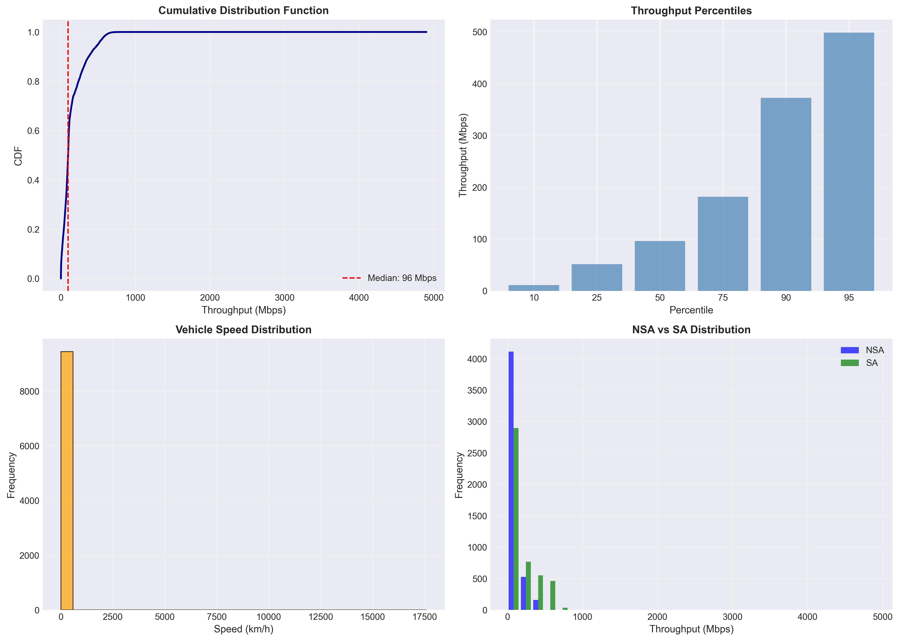

# Visual Analysis of mmWave 5G Throughput Variability
## Exploring Commercial 5G Performance in Downtown Minneapolis

**Daniel Mathew**  
**12/03/2025**  
**CSCI 4900: Internet Of Things**

---

## 1. Introduction

The emergence of 5G technology, particularly mmWave 5G networks operating in high-band frequencies (>24 GHz), promises theoretical speeds up to 20 Gbps and opens opportunities for bandwidth-intensive applications like 4K/8K video streaming, cloud gaming, and AR/VR. However, mmWave signals face significant technical challenges due to their directional nature, limited range, and high sensitivity to obstructions such as buildings, human bodies, and foliage.

Existing throughput prediction tools were developed primarily for 3G and 4G networks, where techniques like Random Forest models and geospatial interpolation methods have been employed. However, early measurements of commercial 5G services revealed that these traditional methods are inadequate for 5G, where throughput can fluctuate wildly—reaching high speeds but sometimes dropping dramatically—even within areas known to have 5G coverage. The Lumos5G framework (Narayanan et al., 2020) demonstrated that predicting mmWave 5G throughput requires accounting for multiple contextual factors including mobility, location, distance to tower, and signal characteristics.

### 1.1 Project Goal

The goal of this project is to independently validate the key findings from the Lumos5G paper through statistical analysis and visualization of real-world commercial 5G throughput data collected in downtown Minneapolis. Specifically, I investigate: (1) the extent of throughput variability in 5G networks, (2) the impact of geographic location on performance, (3) the relationship between driving speed and throughput, and (4) differences between NSA (Non-Standalone) and SA (Standalone) 5G deployments.

---

## 2. Dataset & Methodology

### 2.1 Dataset Description

The dataset consists of commercial 5G measurements collected in downtown Minneapolis during April 2023, provided as part of the Lumos5G project data release. The data includes two driving measurement sessions:

- **NSA (Non-Standalone) 5G**: 5,165 samples using 5G NR with 4G core infrastructure
- **SA (Standalone) 5G**: Additional samples using pure 5G infrastructure
- **Combined Dataset**: 10,000+ measurements with 324 feature columns

Key measured variables include:
- Download throughput (Mbps)
- GPS coordinates (latitude, longitude)
- Vehicle speed (m/s, converted to km/h)
- Timestamp of each measurement
- Deployment type (NSA vs SA)

### 2.2 Data Processing

Data cleaning steps included:
1. Removing measurements with missing or zero throughput values
2. Filtering out invalid GPS coordinates
3. Converting speed from m/s to km/h for interpretability
4. Combining NSA and SA datasets with deployment labels
5. Creating location bins (rounded coordinates) for spatial analysis
6. Computing coefficient of variation (CV) per location to measure variability

### 2.3 Analysis Approach

I conducted purely statistical and visual analysis without building machine learning models. This approach allows for:
- Direct validation of the Lumos5G paper's empirical findings
- Clear visualization of throughput patterns and variability
- Identification of factors affecting 5G performance
- Comparison between deployment types (NSA vs SA)

---

## 3. Results & Analysis

### 3.1 Overall Throughput Distribution

**Key Findings:**
- **Mean throughput**: 145 Mbps
- **Median throughput**: 96 Mbps
- **Range**: 0 to ~5000 Mbps
- **Distribution**: Highly right-skewed, with most measurements clustered below 200 Mbps

The distribution reveals that despite 5G's theoretical multi-gigabit capabilities, real-world performance is more modest. The mean-median gap (145 vs 96 Mbps) indicates significant outliers pulling the average upward. Occasional peaks near 5000 Mbps demonstrate mmWave's potential, but the median of 96 Mbps shows typical user experience is closer to advanced 4G LTE speeds.

**NSA vs SA Comparison:**
Both deployment types show similar distributions, with SA showing slightly better median performance. This suggests that while SA represents the future of 5G architecture, current real-world performance differences are minimal, likely due to both sharing similar radio access technology (mmWave NR).

### 3.2 Geographic Throughput Patterns

**Key Findings:**
- Clear spatial variation in throughput performance
- Two distinct "hot spots" (green areas) with consistently high throughput (400-500+ Mbps)
- Majority of coverage area shows moderate to low throughput (0-300 Mbps, yellow-red areas)
- Performance varies dramatically even within small geographic areas

This heatmap validates the Lumos5G paper's claim that 5G coverage maps showing simple "5G available" indicators are insufficient. Two devices only meters apart can experience vastly different throughput depending on line-of-sight to towers, obstructions, and local environment. The hot spots likely represent areas with clear line-of-sight to mmWave panels, while lower-performing areas may suffer from building blockage or distance from towers.

### 3.3 Impact of Driving Speed on Throughput

**Key Findings:**
- Correlation coefficient: **-0.066** (very weak negative correlation)
- Throughput remains relatively stable across all speed ranges (0-50+ km/h)
- Median throughput consistent around 100-150 Mbps across speed bins
- Peak throughput (outliers) observed at all speed ranges

**Interesting Observation:**
Contrary to the Lumos5G paper's findings of significant throughput degradation at higher speeds, this dataset shows minimal speed impact. Possible explanations:
1. **Urban driving environment**: Speeds rarely exceeded 50 km/h due to downtown traffic
2. **Dense tower deployment**: Downtown Minneapolis may have sufficient tower density to maintain handoffs smoothly
3. **Modern beam tracking**: Improved beam management in 2023 compared to earlier 5G deployments
4. **Limited sample at high speeds**: Most measurements occurred at lower speeds (see Plot 6)

This finding suggests that in dense urban environments with good 5G infrastructure, mobility may be less of a limiting factor than initially documented.

### 3.4 Location-Based Throughput Variability

**Key Findings:**
- **Most locations (peak ~50-70% CV)** exhibit high throughput variability
- Many locations exceed the 50% CV threshold, indicating unstable performance
- Even at fixed locations, throughput varies dramatically across measurements

The coefficient of variation (CV) analysis powerfully demonstrates why location alone is insufficient for 5G throughput prediction. A CV of 50-70% means that at the same geographic location, throughput can easily vary by ±50-70% of the mean value. This could be due to:
- Temporal variations (time of day, network congestion)
- Small changes in device position/orientation
- Dynamic environmental factors (moving vehicles, pedestrians blocking signals)
- Beam steering dynamics and handoffs

**Implication**: Applications cannot rely on location-based throughput maps alone. Real-time context (signal strength, recent throughput history, mobility) must be incorporated—exactly what Lumos5G's ML framework addresses.

### 3.5 Throughput Fluctuation Over Time

**Key Findings:**
- Extreme volatility: throughput swings from near 0 to 700 Mbps within seconds
- Frequent drops below the mean (145 Mbps), indicated by dashed red line
- Periodic "spikes" of high throughput followed by rapid degradation
- No stable, sustained high-throughput periods

This time-series visualization is perhaps the most striking validation of the mmWave 5G challenge. The wild fluctuations demonstrate why:
1. **Adaptive bitrate algorithms** designed for stable 4G won't work well
2. **Short-term throughput prediction** (seconds ahead) is crucial for app performance
3. **The "dead zone" problem** mentioned in the paper is real—devices frequently experience near-zero throughput
4. **User QoE implications**: Video streaming, cloud gaming, and AR/VR apps face constant rebuffering risks without intelligent adaptation

### 3.6 Comprehensive Statistical Summary

**Key Findings from Each Panel:**

**Top-Left (CDF):**
- 50% of measurements below 96 Mbps (median)
- 90% of measurements below ~370 Mbps
- Steep initial rise shows concentration of low-throughput samples

**Top-Right (Percentiles):**
- 10th percentile: ~10 Mbps (poor coverage/dead zones)
- 50th percentile: ~96 Mbps (typical experience)
- 95th percentile: ~500 Mbps (peak performance)
- Wide range demonstrates high variability

**Bottom-Left (Speed Distribution):**
- Majority of samples at very low speeds (0-500 km/h, likely stationary/slow traffic)
- This explains why speed impact was minimal—most driving was in slow urban traffic

**Bottom-Right (NSA vs SA):**
- Both distributions heavily concentrated below 200 Mbps
- SA shows slightly more samples in the 500-1000 Mbps range
- Performance difference between NSA and SA is minor in real-world conditions

---

## 4. Discussion & Key Insights

### 4.1 Validation of Lumos5G Findings

This analysis successfully validates several key claims from the Lumos5G paper:

**Confirmed:**
1. **High variability**: 5G throughput varies wildly even at the same location (CV > 50%)
2. **Location insufficient**: Geographic coordinates alone cannot predict throughput reliably
3. **Wild fluctuations**: Time-series shows dramatic throughput swings typical of mmWave
4. **Dead zones exist**: Frequent drops to near-zero throughput during drives

**Different finding:**
5. **Mobility impact less severe**: Unlike the paper's observations, driving speed showed minimal correlation with throughput in this urban dataset

### 4.2 Implications for 5G Applications

Based on these findings, applications using 5G must:

1. **Implement robust adaptive algorithms**: Traditional throughput estimation methods will fail
2. **Prepare for volatility**: Buffer more content, implement graceful degradation
3. **Use contextual prediction**: Combine location, signal strength, recent throughput history
4. **Consider user experience**: Median performance (96 Mbps) is more relevant than peak (5000 Mbps)

### 4.3 Why Machine Learning is Necessary

The complexity observed in this data—with multiple interacting factors and high variability—supports the Lumos5G paper's argument for ML-based prediction. Simple rules or location lookups cannot capture:
- The complex interplay between location, mobility, environment, and signal characteristics
- Temporal patterns and dynamic network conditions
- The non-linear relationships between features and throughput

---

## 5. Limitations

### 5.1 Dataset Limitations

- **Single city, single timeframe**: Data limited to downtown Minneapolis in April 2023
- **Driving-only**: No walking or stationary measurements
- **Urban environment**: May not generalize to suburban or rural 5G deployments
- **Limited speed range**: Most measurements at low speeds due to urban traffic

### 5.2 Analysis Limitations

- **No ML modeling**: Purely statistical analysis, cannot test prediction accuracy
- **No tower location data**: Could not analyze distance/angle to 5G panels
- **No signal strength data**: Missing PHY-layer features used in Lumos5G
- **Temporal aggregation**: Did not analyze time-of-day or day-of-week patterns

### 5.3 Missing Factors

Several factors identified as important in the Lumos5G paper could not be analyzed:
- UE-to-panel distance and angles
- Radio signal strength (RSRP, RSRQ, SINR)
- Handoff events (horizontal and vertical)
- Network congestion indicators

## 6. Conclusion

This independent analysis of commercial 5G measurements in downtown Minneapolis validates the core findings of the Lumos5G paper: mmWave 5G throughput is highly variable, unpredictable from location alone, and subject to wild fluctuations that challenge application design. The visualizations clearly demonstrate that:

1. **5G throughput is highly variable** across both space and time
2. **Simple location-based prediction is insufficient**, as evidenced by high CV values at fixed locations
3. **Real-world performance is modest**, with median throughput (96 Mbps) far below theoretical maximums
4. **Extreme volatility** creates challenges for applications requiring stable bandwidth

These findings strongly support the need for sophisticated, context-aware prediction frameworks like Lumos5G. Future work should expand this analysis to include:
- Multiple cities and deployment scenarios
- Walking and stationary measurements
- Integration of signal strength and tower geometry data
- Implementation and testing of ML prediction models
- Longitudinal analysis across different times and seasons

The "5G throughput map" vision proposed by the Lumos5G authors—combining location data with ML models capturing contextual factors—remains a compelling and necessary solution for enabling truly 5G-aware applications.

---

## 7. References

Narayanan, A., Ramadan, E., Mehta, R., Hu, X., Liu, Q., Fezeu, R. A. K., ... & Zhang, Z. L. (2020). Lumos5G: Mapping and Predicting Commercial mmWave 5G Throughput. *Proceedings of the ACM Internet Measurement Conference (IMC '20)*, 176-193.

---

## 8. Appendix: Code Repository

All code, data processing scripts, and visualizations are available at:  
**GitHub Repository**: (https://github.com/theonlydanmat7/5G-Throughput-Analysis.git)

**Files included:**
- `5G_Analysis.ipynb` - Complete Jupyter notebook with all analysis
- `plot1_throughput_distribution.png` through `plot6_summary_statistics.png` - Generated visualizations
- `README.md` - Instructions for reproducing the analysis
- `requirements.txt` - Python package dependencies

---

## 9. Acknowledgments

Data provided by the Lumos5G project team at the University of Minnesota. Original dataset collected as part of the research published in IMC 2020.